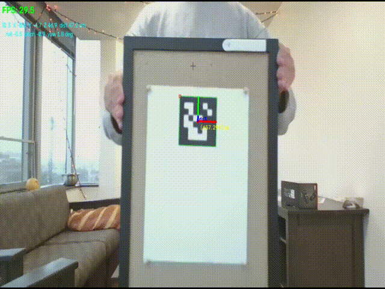
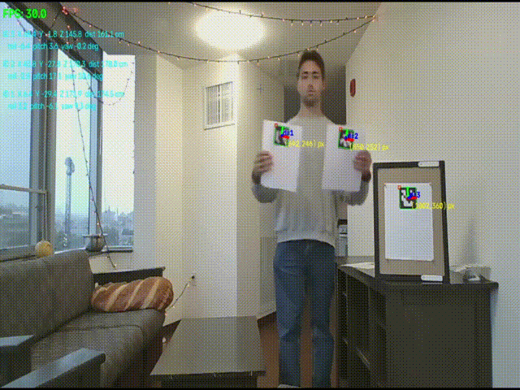
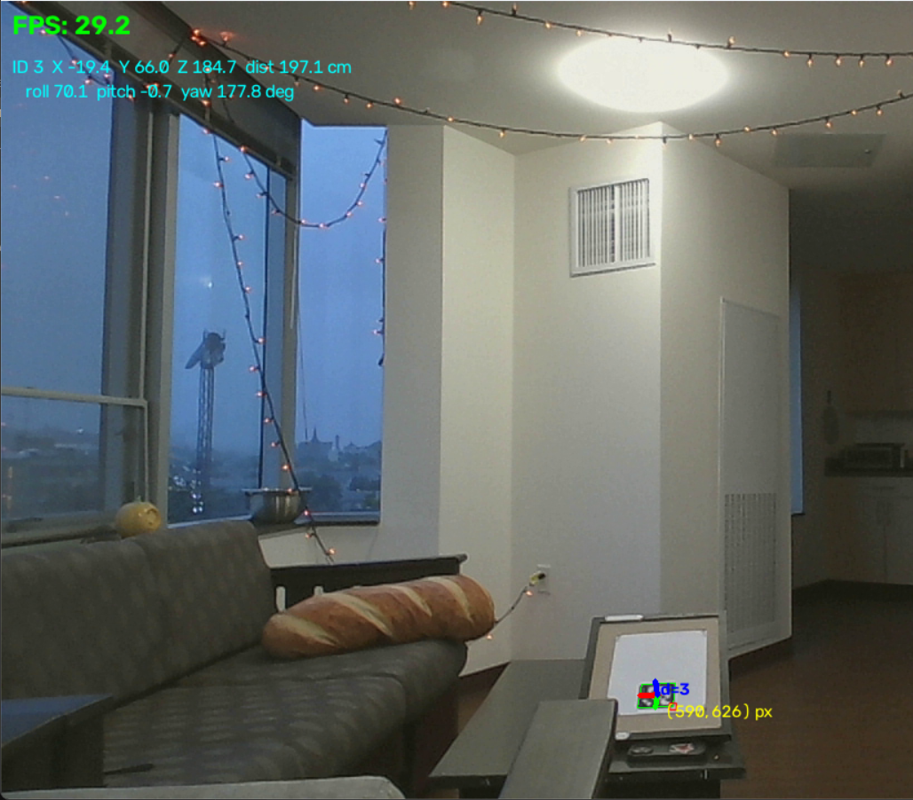
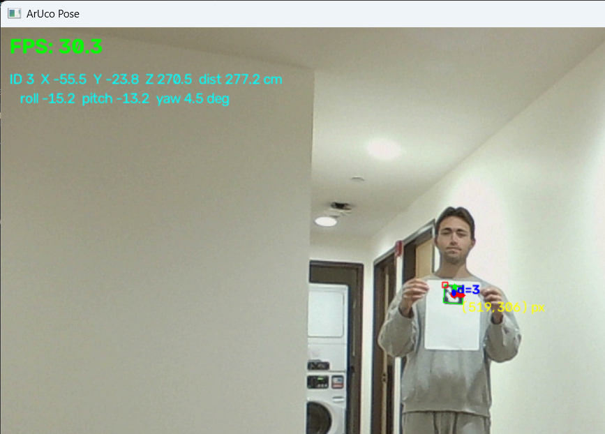

# ArUco 6 DoF Pose Estimation (C++ / OpenCV)

Real-time 6 DoF pose estimation (X, Y, Z + roll, pitch, yaw) of ArUco markers from a single laptop webcam. Built in C++17 with OpenCV and CMake.

I built this to learn C++ and the math behind camera-based pose estimation, and then tested how well it holds up with real, uncontrolled hardware. The testing turned out to be the most valuable part: it showed me how much the camera and its settings decide the final accuracy.

## Demo



| Multiple markers | Tilted marker | Long range |
|---|---|---|
|  |  |  |

Each detected marker gets a green outline, its ID, and its 3D axes (x red, y green, z blue). The top left shows the FPS and, for each marker, its position in cm and its roll, pitch, and yaw. Recorded in my dorm living room with a normal laptop webcam.

## Results

**Setup:** built-in laptop webcam at 1280x720, 80 mm printed markers (DICT_6X6_250), indoor room lighting, distance checked with a tape measure.

### Distance accuracy

| Tape (cm) | App (cm) | Error (cm) | Error (%) | Roll | Pitch | Yaw |
|---:|---:|---:|---:|---:|---:|---:|
| 75.0 | 64.0 | -11.0 | -14.7 | 0 | 0 | 0 |
| 109.0 | 100.0 | -9.0 | -8.3 | 0 | -10 | -90 |
| 117.0 | 98.0 | -19.0 | -16.2 | -4 | -3 | 0 |
| 119.0 | 97.0 | -22.0 | -18.5 | -6 | -57 | 0 |
| 145.2 | 126.6 | -18.6 | -12.8 | -6 | 5 | 0 |
| 211.0 | 200.0 | -11.0 | -5.2 | 70 | 0 | -179 |
| 215.0 | 200.0 | -15.0 | -7.0 | 12 | 0 | 180 |
| 242.0 | 220.0 | -22.0 | -9.1 | 0 | -23 | -2 |

- **Every reading was short.** Mean error was -15.9 cm (-11.5%).
- **The error is mostly a constant offset, not a scale error.** A best-fit line gives `app = 0.98 x tape - 12.7 cm`. The scale is within 2%, but there is a steady gap of about 13 to 16 cm. That is why the percent error drops as distance grows (about 15% up close, 5 to 9% past 2 m).
- **What this points to:** a bad calibration (wrong focal length) would scale every reading by the same percent. A constant gap instead suggests the tape and the app measured from different starting points. The app measures from the camera's optical center, which sits inside the lens in the screen bezel.
- **How I would confirm it:** tape from the lens itself, and repeat 3 to 5 readings at each distance to see the spread. If the gap disappears, the offset was the measurement setup, not the software.

The calibration RMS was 1.43 px, which is above the usual target of under 1.0 px. I expected that to be the main error source, but a pixel-level error like that would add noise and a small scale error, not a steady 13 cm gap.

### Detection limits

Largest angle where the marker was still detected:

| Distance | Max roll | Max pitch |
|---|---:|---:|
| 50 cm | - | 86 deg |
| under 100 cm | 85 deg | - |
| 100 cm | - | 75 deg |
| 150 cm | 80 deg | - |
| over 200 cm | 70 deg | 50 deg |

- Max roll drops about 5 deg per 50 cm of distance. Max pitch drops much faster.
- Yaw (spinning the marker flat, in the image plane) did not affect detection at any distance.
- **Max range with a decent detection rate: about 315 cm under ideal lighting.**
- **Less ideal lighting conditions results in a max around 270 cm**

Why range runs out: at 315 cm an 80 mm marker is only about 18 px wide in the image (`fx x size / distance = 718 x 0.08 / 3.15`). A 6x6 marker plus its black border is 8 cells across, so each cell is only about 2 px. Tilting it shrinks it even more in one direction, which is why the max angle drops with distance.

### Speed and robustness

- **Steady 30 FPS** through all tests and lighting conditions. This is most likely the webcam's own frame rate cap, not the code.
- **Multiple markers** in view at once did not change the accuracy of each one.
- **Lighting:** low to medium light gave better contrast. Bright light overexposed the image and hurt detection.

## Findings

- **The hardware sets the ceiling.** A laptop webcam runs auto exposure and autofocus, and I could not lock them. Autofocus changes the focal length slightly, and calibration assumes it stays fixed. In high school FRC robotics we used cameras with locked exposure, focus, and ISO, and got reliable detection past 7 m. Those tags were also about twice the size (6.5 in vs 80 mm), and detection range scales with marker size.
- **Measurement setup matters as much as the code.** My biggest error turned out to be about where I measured from, not the vision math.
- **Real conditions are never ideal.** Lighting, glare, and camera auto settings all change during a test. As an Applied AI student, this is the same lesson as training on varied data: a system tuned for perfect conditions breaks in the real world, so you design and test for the messy case.

## How it works

The pipeline runs once per camera frame:

1. **Calibration (once, offline).** `calibrate_camera` finds a printed checkerboard in 20+ photos at different angles. From how the known grid gets distorted in the images, `cv::calibrateCamera` solves for the camera's intrinsics: focal length (fx, fy), optical center (cx, cy), and lens distortion. These are saved to `config/camera_intrinsics.yaml`. My result: fx = fy = 718 px, RMS error 1.43 px.
2. **Detection (2D only).** `cv::aruco::ArucoDetector` converts the frame to grayscale, thresholds it to black and white, and finds 4-sided shapes. It unwarps each one to a flat square, reads the 6x6 grid of black and white cells as bits, and looks the pattern up in the dictionary to get the marker ID. Corners are then refined to sub-pixel accuracy. This step does not use calibration at all.
3. **Pose (2D to 3D).** The app knows the marker's real size (80 mm), so it knows where the 4 corners are in 3D, relative to the marker's center. `cv::solvePnP` (with `SOLVEPNP_IPPE_SQUARE`, a solver made for square markers) finds the rotation and translation that make those 3D corners line up with the 4 detected pixel corners, using the calibrated intrinsics. The result is the marker's position in meters and its rotation.
4. **Display.** The rotation is converted to roll, pitch, and yaw, measured from "marker facing the camera, upright". `cv::drawFrameAxes` draws the 3D axes on the marker as a visual check.

**Coordinate frame:** camera frame, x right, y down, z straight out of the lens. `dist` is the straight-line distance from the camera to the marker's center.

The pose is only as accurate as the calibration and the known marker size. If either is off, every distance is off.

## Limitations

- Laptop webcam with auto exposure and autofocus that cannot be locked.
- Calibration RMS of 1.43 px (target is under 1.0 px).
- Ground truth measured by hand with a tape measure, one reading per position.
- Far or very tilted markers can briefly flip their axes. With only 4 points on a flat square, two different poses can fit almost equally well (PnP ambiguity).
- No smoothing, so readings jitter by a small amount frame to frame.

## Future work

- Repeat the distance tests measured from the lens, with several readings per point, to confirm the offset.
- Relative pose between two markers (marker-to-marker distance, checked with a ruler).
- Smoothing to reduce jitter, and measure the jitter before and after.
- Log results to CSV from the app instead of reading the screen.
- Test with an external camera that allows locked exposure and focus.

## Build (Windows, MSVC)

Requires CMake 3.21+ and OpenCV 4.7+ (developed on OpenCV 5.0). Set `OpenCV_DIR` if OpenCV is not at `C:/opencv/build`. The build copies the OpenCV DLLs next to the executables, so no PATH setup is needed.

```
cmake -S . -B build
cmake --build build --config Release
```

## Run (from the repo root)

1. Print a checkerboard (10x7 squares, 9x6 inner corners) and ArUco markers (6x6, DICT_6X6_250).
2. Measure the square size and the marker's black edge with a ruler. Put both, in meters, in `config/app.yaml`.
3. Calibrate. SPACE captures a view, `c` calibrates and saves, `q` quits. Capture 15 to 25 views at different angles, distances, and image corners.
   ```
   .\build\Release\calibrate_camera.exe
   ```
4. Run live pose estimation:
   ```
   .\build\Release\pose_app.exe
   ```

## Project structure

```
include/aruco_pose/   Headers, one class per file (detector, pose estimator, calibration, ...)
src/                  Implementations
apps/                 calibrate_camera and pose_app executables
config/app.yaml       Camera, board, and marker settings
docs/media/           Demo GIFs and photos
```

## License

MIT. See [LICENSE](LICENSE).
